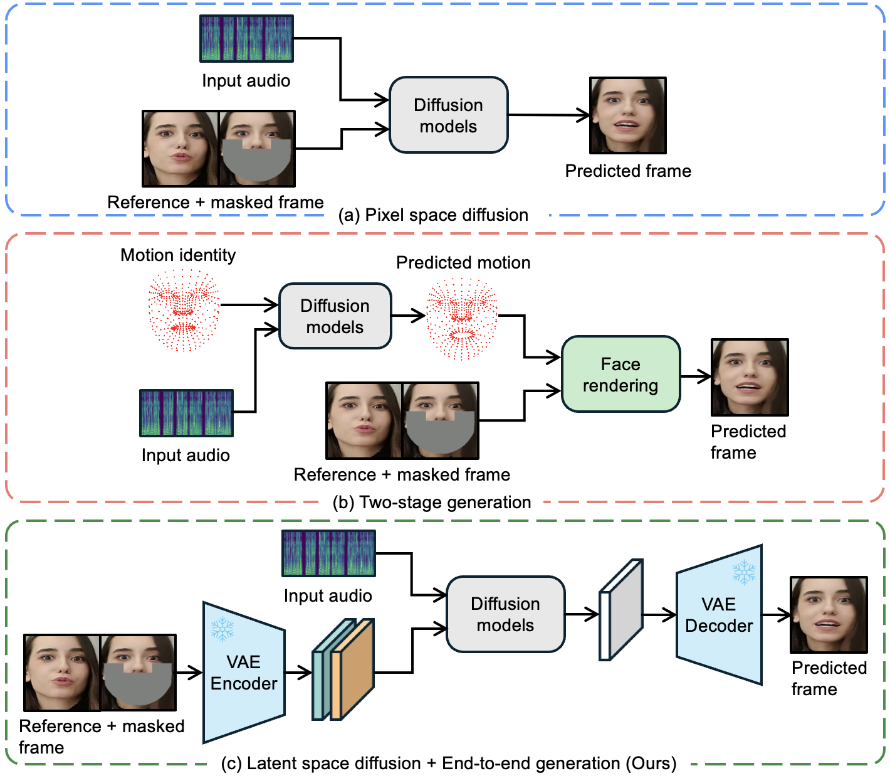

# LatentSync: Audio Conditioned Latent Diffusion Models for Lip Sync

## 📖 Introduction

We present LatentSync, an end-to-end lip sync framework based on audio conditioned latent diffusion models without any intermediate motion representation, diverging from previous diffusion-based lip sync methods based on pixel space diffusion or two-stage generation. Our framework can leverage the powerful capabilities of Stable Diffusion to directly model complex audio-visual correlations.

## Demo

<table class="center">
  <tr style="font-weight: bolder;text-align:center;">
        <td width="50%"><b>Original video</b></td>
        <td width="50%"><b>Lip-synced video</b></td>
  </tr>
  <tr>
    <td>
      <video src=https://github.com/user-attachments/assets/03e95555-39c5-4e46-8df3-69d24a95c84e controls preload></video>
    </td>
    <td>
      <video src=https://github.com/user-attachments/assets/122f7678-cc13-46f6-890b-c50a198548df controls preload></video>
    </td>
  </tr>
  <tr>
    <td>
      <video src=https://github.com/user-attachments/assets/f5804101-ea20-42eb-8d92-2e8a542d6b97 controls preload></video>
    </td>
    <td>
      <video src=https://github.com/user-attachments/assets/e701cebd-12b6-4751-97cb-6b45e6c0036a controls preload></video>
    </td>
  </tr>
  <tr>
    <td>
      <video src=https://github.com/user-attachments/assets/b7da5495-a02b-4efe-86bf-df56246725f0 controls preload></video>
    </td>
    <td>
      <video src=https://github.com/user-attachments/assets/99fcf7e7-2db7-488b-93de-c6ed78203a6d controls preload></video>
    </td>
  </tr>
  <tr>
    <td width=300px>
      <video src=https://github.com/user-attachments/assets/d08287ad-48c1-4bc3-8c8f-a333cf57f5fa controls preload></video>
    </td>
    <td width=300px>
      <video src=https://github.com/user-attachments/assets/872525ef-bac4-44d1-9ecf-d51928b3aaf5 controls preload></video>
    </td>
  </tr>
  <tr>
    <td>
      <video src=https://github.com/user-attachments/assets/3732d784-e86f-43e3-964a-eb5a01a55e78 controls preload></video>
    </td>
    <td>
      <video src=https://github.com/user-attachments/assets/03540ae6-e75d-4314-aaaa-bdc886ecc466 controls preload></video>
    </td>
  </tr>
</table>

(Photorealistic videos are filmed by contracted models, and anime videos are from [VASA-1](https://www.microsoft.com/en-us/research/project/vasa-1/) and [EMO](https://humanaigc.github.io/emote-portrait-alive/))

## 📑 Open-Source Plan

- [ ] Inference code and checkpoints
- [ ] Data processing pipeline
- [ ] Training code
